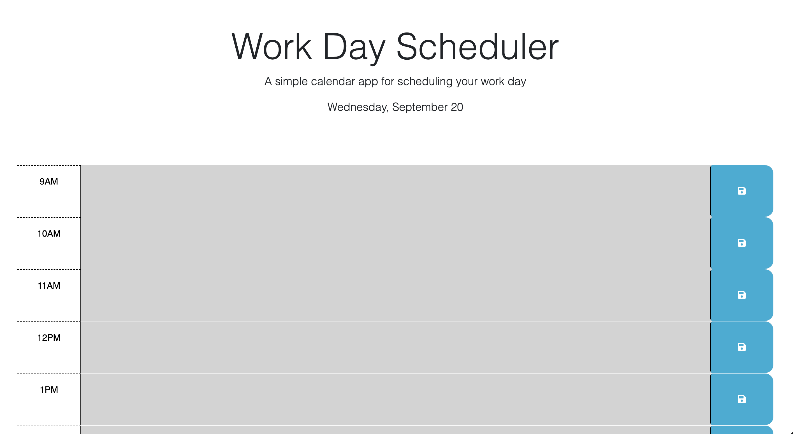
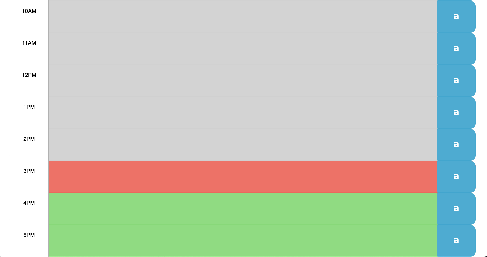

# Work Day Scheduler

## Description

In this assignment we were task to use Jquery to update the starter to code.  We had to use the current time to apply certain classes to the time blocks (past, present & future).  We also had to give the use the ability to save a new event to localstorage and recall that info when the page is loaded.

## Repository

Link to deployed code:  https://jarrodkrauszer.github.io/work_day_scheduler/

## Technologies

 - We used a mixture of HTML and CSS to create the pages
 - We used JQuery to apply the correct classed using conditional statements
 - We used localstorage to save and restrieve saved data.

## Mock-Up

The following image shows the web application's appearance and functionality:

